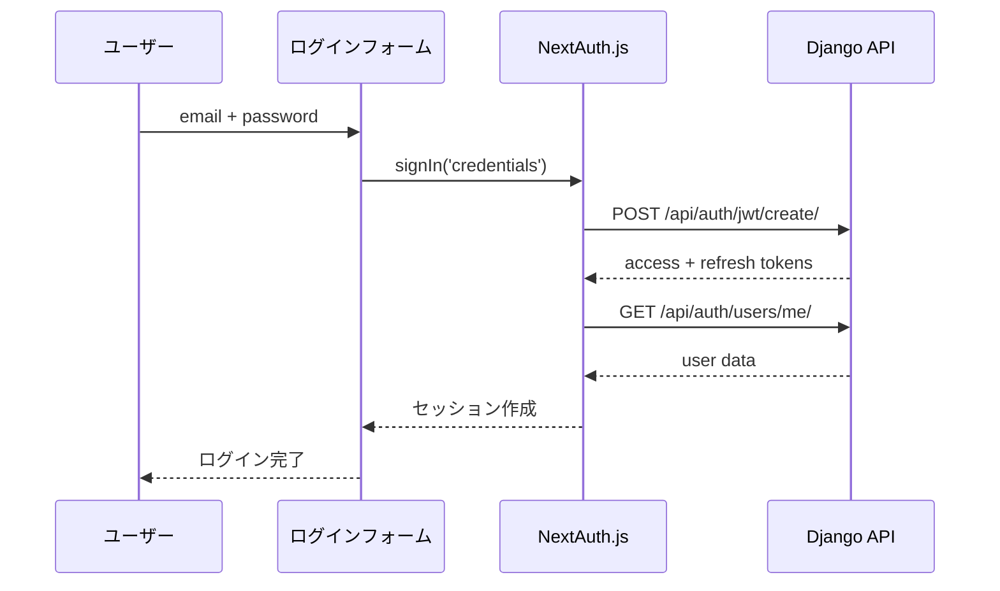
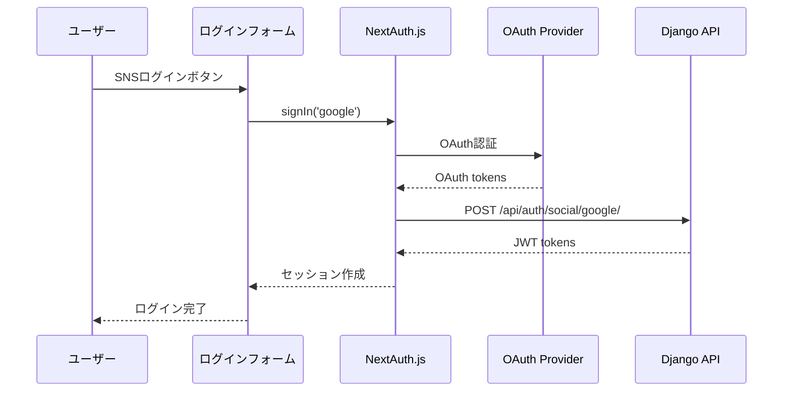

# 認証システム（NextAuth.js + JWT）

## 📋 概要

NextAuth.js + JWTトークンベースの認証システムで、SNS認証（Google、Facebook、LINE等）に対応した現代的な認証機能を提供しています。

## 🏗️ システム構成

### フロントエンド（Next.js 14 + NextAuth.js v4）
- **認証管理**: NextAuth.js v4
- **セッション管理**: JWT + httpOnlyクッキー
- **状態管理**: useSession フック
- **API通信**: session-based fetch with JWT

### バックエンド（Django + Django REST Framework）
- **認証エンジン**: Django + Djoser + SimpleJWT
- **エンドポイント**: `/api/auth/jwt/create/`、`/api/auth/users/me/`
- **トークン**: JWT（access + refresh）

## 🔑 認証フロー

### 1. 通常ログイン（Credentials Provider）


### 2. SNS認証（OAuth Provider）


## 🛠️ 実装詳細

### コア設定ファイル

#### 1. NextAuth.js設定
```typescript
// src/app/api/auth/[...nextauth]/route.ts
export const authOptions: NextAuthOptions = {
  providers: [
    GoogleProvider({
      clientId: process.env.GOOGLE_CLIENT_ID!,
      clientSecret: process.env.GOOGLE_CLIENT_SECRET!,
    }),
    CredentialsProvider({
      // Django APIとの認証統合
    })
  ],
  callbacks: {
    async jwt({ token, user, account }) {
      // JWT token management
    },
    async session({ session, token }) {
      // Session object creation
    }
  },
  pages: {
    signIn: '/login',
    error: '/login', // エラー時もログインページにリダイレクト
  },
  session: {
    strategy: 'jwt',
  }
}
```

#### 2. 互換性フック
```typescript
// src/hooks/useAuthSession.ts
export const useAuthSession = () => {
  const { data: session, status } = useSession();

  const user: User | null = session?.user ? {
    id: parseInt(session.user.id),
    uid: session.uid || '',
    email: session.user.email,
    name: session.user.name,
    avatar: session.user.image,
  } : null;

  const isLoggedIn = !!session && status === 'authenticated';
  const isLoading = status === 'loading';

  return { user, isLoggedIn, isLoading, session, status };
};
```

#### 3. セッションベースAPI通信
```typescript
// src/app/lib/fetchWithSession.ts
export const fetchWithSession = async (
  input: RequestInfo | URL,
  init: RequestInit = {}
): Promise<Response> => {
  const session = await getSession();
  const accessToken = session?.accessToken || null;

  const headers: Record<string, string> = {
    ...(init.headers as Record<string, string>),
    ...(accessToken ? { Authorization: `JWT ${accessToken}` } : {}),
  };

  return fetch(input, { ...init, headers });
};
```

## 🔐 セキュリティ仕様

### セッション管理
- **httpOnlyクッキー**: XSS攻撃を防止
- **SameSite=lax**: CSRF攻撃を軽減
- **Secure**: HTTPS環境で暗号化
- **JWT Strategy**: サーバーレス環境対応

### トークン管理
- **Access Token**: 短期間（15分）でAPI認証
- **Refresh Token**: 長期間（7日）でトークン更新
- **自動更新**: NextAuth.jsが自動的にtoken refresh

## 🌐 SNS認証対応

### 設定済みプロバイダー
- **Google OAuth 2.0**
- **Facebook Login**
- **LINE Login**（設定予定）

### OAuth設定手順
1. **Google**: [Google Cloud Console](https://console.cloud.google.com/)
2. **Facebook**: [Meta for Developers](https://developers.facebook.com/)
3. **LINE**: [LINE Developers](https://developers.line.biz/)

### 環境変数設定
```bash
# .env
NEXTAUTH_URL=http://localhost:3002
NEXTAUTH_SECRET=your-secret-key-change-this-in-production

# Google OAuth
GOOGLE_CLIENT_ID=your-google-client-id
GOOGLE_CLIENT_SECRET=your-google-client-secret

# Facebook OAuth
FACEBOOK_CLIENT_ID=your-facebook-client-id
FACEBOOK_CLIENT_SECRET=your-facebook-client-secret

# LINE OAuth
LINE_CLIENT_ID=your-line-client-id
LINE_CLIENT_SECRET=your-line-client-secret
```

## 📁 主要ファイル構成

### 認証関連ファイル
```
src/
├── app/
│   ├── api/auth/[...nextauth]/route.ts     # NextAuth.js設定
│   ├── lib/fetchWithSession.ts             # セッションベースfetch
│   └── types/next-auth.d.ts                # NextAuth型定義
├── hooks/
│   └── useAuthSession.ts                   # 互換性フック
├── components/
│   ├── Auth/LoginForm/                     # ログインフォーム
│   ├── Layout/Header/                      # ヘッダー（ログイン状態表示）
│   └── Provider/                           # SessionProvider
└── middleware.ts                           # NextAuth.js middleware
```

### 移行済みコンポーネント（23ファイル）
```
✅ src/components/Layout/Header/index.tsx
✅ src/components/Account/Dashboard/index.tsx
✅ src/components/shop/ShopCard/index.tsx
✅ src/components/shop/ShopGridCard/index.tsx
✅ src/components/shop/ShopList/index.tsx
✅ src/app/shops/page.tsx
✅ src/app/favorite/page.tsx
✅ src/app/visited/page.tsx
✅ src/app/wishlist/page.tsx
✅ src/app/shops/[id]/page.tsx
✅ src/app/user/[id]/page.tsx
... (他13ファイル)
```

## 🔧 デバッグ・トラブルシューティング

### ログ出力
```typescript
// NextAuth.js credentials provider
console.log('🔒 NextAuth credentials provider called')
console.log('📡 Django API response status:', res.status)
console.log('✅ User data received:', userData)
```

### 一般的なエラーと対策

#### 1. 404 Error on `/api/auth/error`
**原因**: NextAuth.jsのエラーページ設定不備
**対策**: `pages.error: '/login'`を設定済み

#### 2. JWT Token Expired
**原因**: アクセストークンの有効期限切れ
**対策**: NextAuth.jsが自動でrefresh token使用

#### 3. CORS Error
**原因**: Django設定でフロントエンドドメイン許可不足
**対策**: `CORS_ALLOWED_ORIGINS`にNext.jsのURLを追加

## 🚀 今後の拡張予定

### Phase 3: SNS認証実装
- [ ] Google Cloud Console OAuth設定
- [ ] Facebook Developers OAuth設定
- [ ] LINE Developers OAuth設定
- [ ] TikTok for Developers OAuth設定

### Phase 4: 旧システム削除
- [ ] Djoser依存関係削除
- [ ] useAuthStore削除
- [ ] localStorage認証削除
- [ ] fetchWithAuth削除

### Phase 5: 高度な機能
- [ ] Multi-factor Authentication（MFA）
- [ ] OAuth scope管理
- [ ] Session analytics
- [ ] Role-based access control

## 📚 参考リンク

- [NextAuth.js Documentation](https://next-auth.js.org/)
- [Django Djoser Documentation](https://djoser.readthedocs.io/)
- [JWT.io](https://jwt.io/)

---

## 🕰️ 2025.10.10修正前の認証ロジック

### 旧システム構成（localStorage + Zustand）

#### フロントエンド認証管理
```typescript
// 旧: src/store/useAuthStore.ts
interface AuthState {
  user: User | null;
  isLoggedIn: boolean;
  login: (email: string, password: string) => Promise<void>;
  logout: () => void;
  fetchUser: () => Promise<void>;
}

// localStorage使用（セキュリティリスク）
const useAuthStore = create<AuthState>((set, get) => ({
  user: null,
  isLoggedIn: false,

  login: async (email: string, password: string) => {
    const response = await fetch('/api/auth/jwt/create/', {
      method: 'POST',
      headers: { 'Content-Type': 'application/json' },
      body: JSON.stringify({ email, password }),
    });

    const tokens = await response.json();

    // ❌ localStorageに直接保存（XSS脆弱性）
    localStorage.setItem('accessToken', tokens.access);
    localStorage.setItem('refreshToken', tokens.refresh);

    set({ isLoggedIn: true });
  }
}));
```

#### 旧API通信方法
```typescript
// 旧: src/utils/fetchWithAuth.ts
export const fetchWithAuth = async (url: string, options: RequestInit = {}) => {
  // ❌ localStorageから直接取得
  const token = localStorage.getItem('accessToken');

  return fetch(url, {
    ...options,
    headers: {
      ...options.headers,
      ...(token ? { Authorization: `JWT ${token}` } : {}),
    },
  });
};
```

### 旧システムの問題点

#### セキュリティ問題
- **localStorage使用**: XSS攻撃でトークン盗取可能
- **クライアントサイド認証**: サーバーサイドレンダリング不可
- **CSRF脆弱性**: 適切なCSRF対策なし

#### 開発・運用問題
- **SNS認証未対応**: OAuth実装が困難
- **SSR非対応**: Next.jsの利点を活用できない
- **トークン管理**: 手動でrefresh token処理
- **状態管理複雑**: Zustand + localStorage の二重管理

#### パフォーマンス問題
- **初期レンダリング**: クライアントサイドでのみ認証状態確認
- **SEO問題**: 認証が必要なページのSSR不可
- **Hydration Error**: サーバーとクライアントの認証状態不一致

### 移行による改善効果

#### セキュリティ向上
- ✅ **httpOnlyクッキー**: XSS攻撃を完全防止
- ✅ **サーバーサイド認証**: より安全な認証フロー
- ✅ **CSRF防止**: SameSite cookieでCSRF軽減

#### 開発効率向上
- ✅ **SNS認証対応**: OAuth 2.0標準対応
- ✅ **SSR対応**: Next.js App Routerフル活用
- ✅ **自動トークン管理**: NextAuth.jsが自動処理
- ✅ **統一API**: useSession一つで全て管理

#### パフォーマンス向上
- ✅ **SSR認証**: サーバーサイドで認証状態確認
- ✅ **SEO改善**: 認証ページもSSR可能
- ✅ **Hydration安定**: サーバー・クライアント状態一致

---

## 🔄 更新履歴

- **2025-10-10**: NextAuth.js認証システム導入完了
- **2025-10-10**: 全23ファイル移行完了
- **2025-10-10**: エラーハンドリング・デバッグログ追加
- **2025-10-10**: 初版ドキュメント作成、旧システム履歴追加